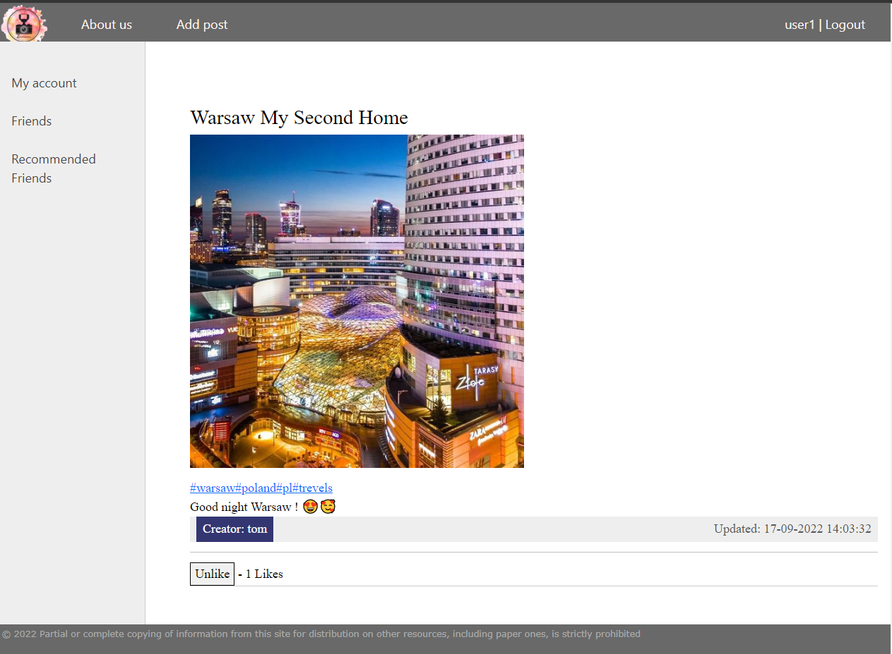
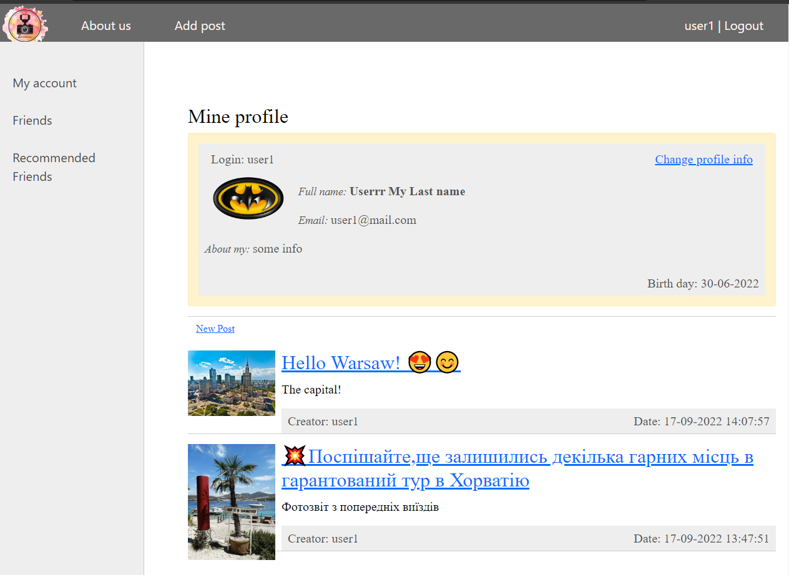
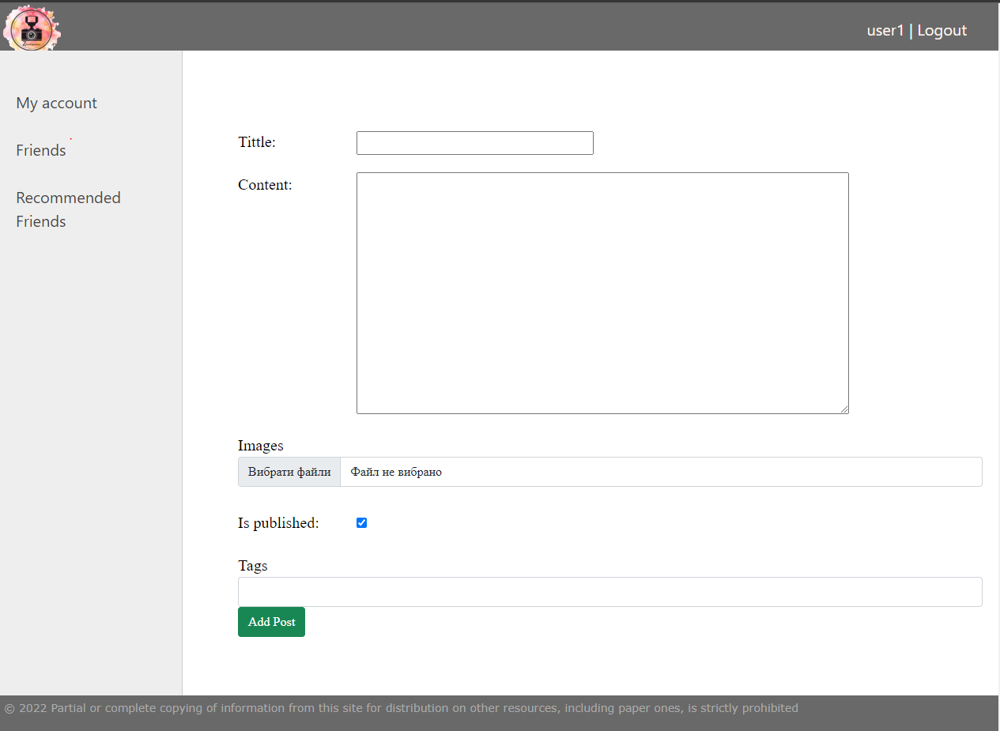
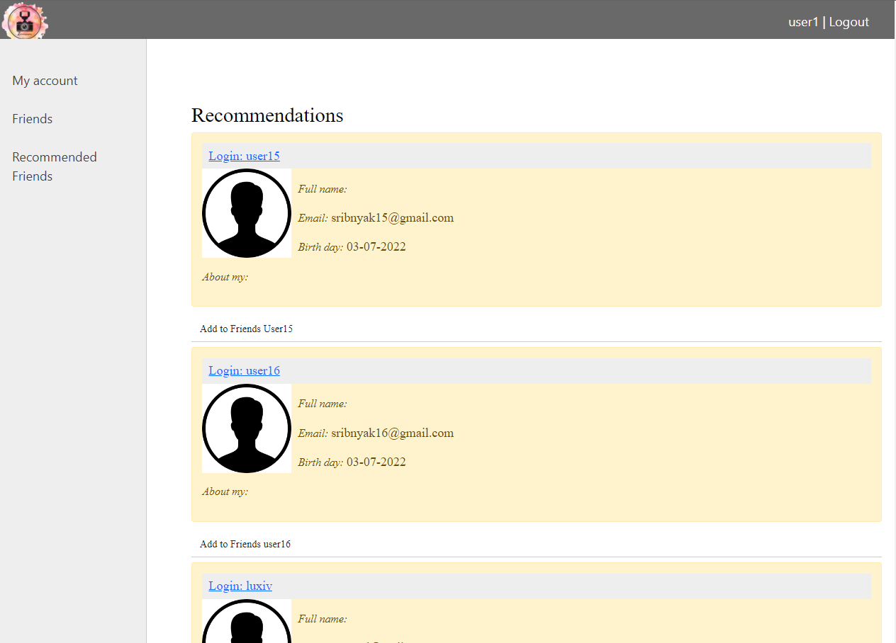

# Django Gram
___
### Basic functional of social network
This is a program like Instagram or Facebook.

The user can register on the website by email.
Unauthorized guests cannot view the profile and pictures of users.

:white_check_mark: Each post may have multiple images

:white_check_mark: Each post may have multiple tags. New tags may be added by authors.

:white_check_mark: Users may like posts (and unlike as well)

Each user has his own profile, where he can change information about himself 

Or add new publications.

:white_check_mark: Each user can add friends from recommendations

And lots of others:heavy_exclamation_mark: